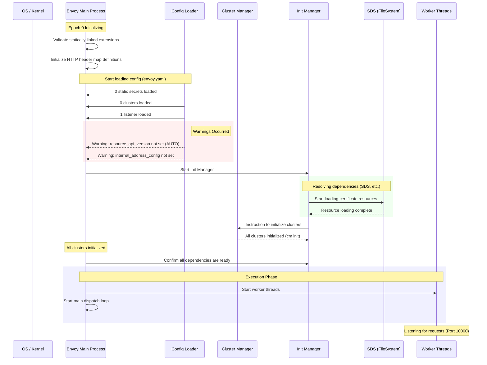

# Envoy File-based SDS Deployment

- [Envoy File-based SDS Deployment](#envoy-file-based-sds-deployment)
  - [Sequence](#sequence)
  - [Deployment Steps](#deployment-steps)
    - [1. Create kind Cluster](#1-create-kind-cluster)
    - [2. Prepare Certificates](#2-prepare-certificates)
    - [3. Create ConfigMaps](#3-create-configmaps)
    - [4. Apply Deployment](#4-apply-deployment)
  - [Zero-Downtime Certificate Rotation](#zero-downtime-certificate-rotation)
    - [1. Check Certificates](#1-check-certificates)
    - [2. Generate New Certificates](#2-generate-new-certificates)
    - [3. Update ConfigMap](#3-update-configmap)
    - [4. Check Certificates](#4-check-certificates)

Deployment procedure for certificate management on Kubernetes using file-based SDS (Secret Discovery Service) via ConfigMaps.

## Sequence



## Deployment Steps

### 1. Create kind Cluster

```bash
kind create cluster --name envoy-sds-lab

```

### 2. Prepare Certificates

If you don't have certificates yet, generate them in the `dmmy_keys` directory.

```bash
openssl req -x509 -newkey rsa:2048 -keyout dmmy_keys/key.pem -out dmmy_keys/cert.pem -sha256 -days 365 -nodes -subj "/CN=envoy-sds-v1"

```

### 3. Create ConfigMaps

Create two ConfigMaps: one for the Envoy static configuration and another for the certificates and SDS resource definitions.

```bash
# Envoy static configuration
kubectl create configmap envoy-static-config --from-file=envoy.yaml=envoy/enovy.yaml

# SDS resources and certificates (these are updated as a set)
kubectl create configmap sds-config \
  --from-file=sds-resource.yaml=envoy/sds-resource.yaml \
  --from-file=cert.pem=dmmy_keys/cert.pem \
  --from-file=key.pem=dmmy_keys/key.pem
```

### 4. Apply Deployment

```bash
kubectl apply -f k8s/envoy-deploy.yaml
```

---

## Zero-Downtime Certificate Rotation

This procedure replaces the certificates without restarting the Pod.

### 1. Check Certificates

```bash
kubectl port-forward deployment/envoy-sds 10000:10000
```

```bash
curl -vk https://localhost:10000 2>&1 | grep "subject:"
# *  subject: CN=envoy-sds-v1
```

### 2. Generate New Certificates

```bash
openssl req -x509 -newkey rsa:2048 -keyout dmmy_keys/key.pem -out dmmy_keys/cert.pem -sha256 -days 365 -nodes -subj "/CN=envoy-sds-v2-updated"
```

### 3. Update ConfigMap

Overwrite the existing ConfigMap using `kubectl apply`.

```bash
kubectl create configmap sds-config \
  --from-file=sds-resource.yaml=envoy/sds-resource.yaml \
  --from-file=cert.pem=dmmy_keys/cert.pem \
  --from-file=key.pem=dmmy_keys/key.pem \
  --dry-run=client -o yaml | kubectl apply -f -
```

### 4. Check Certificates

```bash
curl -vk https://localhost:10000 2>&1 | grep "subject:"
# *  subject: CN=envoy-sds-v2-updated
```
